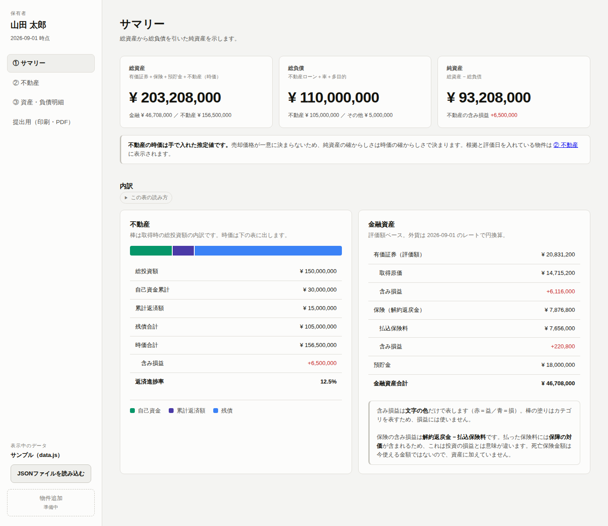
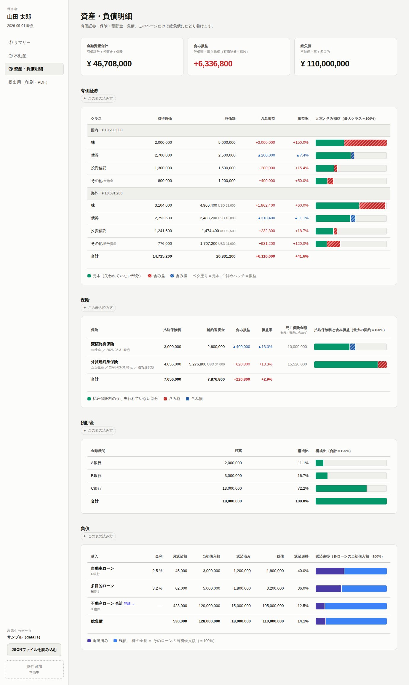

# 資産可視化ダッシュボード

自分の資産を**棚卸し**するための3ページのダッシュボード。
どこに何がいくらあるかを、1枚のデータファイルから静かに描くだけの道具です。



*画面はサンプルデータ（架空の「山田 太郎」）です。*

---

## 動かし方

**`mock/index.html` をダブルクリックするだけ。** サーバもインストールも要りません。

最初はサンプルが表示されます。自分のデータを映すには、左下の
**「JSONファイルを読み込む」** から自分の JSON を選びます。

作り方は [`data/README.md`](data/README.md) にあります。Excel に入力して
JSON に変換するのが簡単です。

```
Excel（data/input-sheet.xlsx）に入力
        ↓  tools/xlsx_to_json.py
my-assets.json
        ↓  画面の「JSONファイルを読み込む」
ダッシュボードに表示
```

---

## 3つのページ

| # | ページ | 役割 |
|---|---|---|
| ① | サマリー | **金融資産**と**総負債**を並べる。合算も引き算もしない |
| ② | 不動産 | 物件別の投資構成と月次収支 |
| ③ | 資産・負債明細 | 有価証券・保険・預貯金・負債 |
| — | 提出用 | 上記を1つの文書に連結。⌘P で PDF になる |



---

## この道具が「やらない」こと

**利回り・円グラフ・ドーナツ・履歴・株価API は、意図的に外してあります。**

たとえば利回りを出さないのは「利回りの高い物件が良い物件」という読み方を
誘発し、棚卸しという目的から外れるためです。

**純資産・総資産・LTV は、条件つきで出します。** 不動産の時価は任意入力で、
**全物件に時価が入っているときだけ**これらを計算します。1件でも欠けたまま
引き算すると、資産側だけが小さくなって純資産を実態より低く見せるからです。
欠けているときは金額を出さず、何件欠けているかを表示します。

不動産の時価は売却価格が一意に決まるものではないため、**保有者が入力した推定値**
として扱い、画面にも紙にもその旨を明記しています。

**却下した案とその理由はすべて [`SPEC.md`](SPEC.md) に記録してあります。**
これらを復活させるには新しい理由が要ります。

---

## 設計の芯

- **正しさより読みやすさを優先しない。** 数字は正直に出し、
  ズレの理由は画面上の文章で説明する
- **塗られた面 ＝ 何であるか。文字の色 ＝ 良いか悪いか。**
  ベタ塗り＝元本・カテゴリ、斜めハッチ＝損益。
  ハッチは装飾ではなく、色覚多様性とダークモードで判読性を保つために必須です
- **外部依存ゼロ。** CDN・npm・ビルド・外部APIを使いません。
  株価も為替も取りに行かず、データファイルに手書きして固定します
- **スナップショットのみ。** 履歴も前回比も持ちません

---

## ファイル

| 場所 | 中身 |
|---|---|
| [`mock/`](mock/) | ダッシュボード本体。`index.html` を開けば動く |
| [`data/`](data/) | 入力用のひな形と、書き方の説明書 |
| [`tools/`](tools/) | Excel → JSON の変換ツール。画面の動作には関係しない |
| [`docs/`](docs/) | 最初の手書きスケッチと、1枚目に作ったUI |
| [`SPEC.md`](SPEC.md) | 確定仕様と、**却下した案とその理由** |
| [`CLAUDE.md`](CLAUDE.md) | このリポジトリで作業するときの決めごと |

---

## 金融機関などに提出するとき

サイドバーの **「提出用（印刷・PDF）」** を開き、⌘P →「PDFに保存」で1つの PDF になります。
Chrome では「詳細設定 → 背景のグラフィック」にチェックを入れてください
（入れないと棒グラフが白く抜けます）。

**送るのは PDF です。Excel と JSON は送りません。**
Excel には検算タブや見本行など相手に不要なものが入り、受け取った側が書き換えられます。

なお、この資料は**保有者が作成した一覧であり、残高証明書・登記事項証明書などの証憑
ではありません**。金融機関は原本を別途求めます。PDF の末尾にもその旨を記載しています。

## 個人データについて

**このリポジトリは public です。本物の資産データは絶対に commit しません。**

`data/` に入っているのは白紙のひな形（`template.json` / `input-sheet.xlsx`）と
説明書だけで、記入済みのファイルは `.gitignore` で除外してあります。
氏名と資産の全額が1つのファイルに揃うため、扱いそのものが設計要件です。

---

## 現在地

| フェーズ | 状態 |
|---|---|
| 画面構成の設計 | ✅ 完了 |
| モック作成 | ✅ 完了 |
| データ形式の確定と入力手段 | ✅ 完了 |
| 実データでの試運転 | ✅ 完了 |
| 提出用 PDF | ✅ 完了 |
| 実装 | ⬜ 未着手 |
